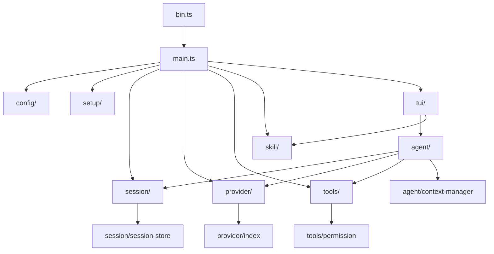

# hcent 架构总入口

> 状态：current
> 最后审阅：2026-07-08（attention 与 ESLint 规则同步）

## 1. 项目简介

hcent 是终端编码助手：用户在 TUI 中用自然语言下达开发任务，Agent 结合当前工作目录上下文理解意图、调用工具、基于结果继续推理，直到给出最终回复或达到轮次上限。

运行时形态为 Node.js CLI（`hcent`）：TUI 接收用户输入，经 Agent 循环调用 LLM 与工具，会话与权限由自研模块编排（`agent/`、`tools/`、`session/`）。

技术栈：TypeScript；TUI 基于 `@earendil-works/pi-tui`；LLM 通过 OpenAI 兼容 API 接入（默认 DeepSeek 官方 `https://api.deepseek.com`）；质量门禁 ESLint + pre-commit（见 `.kflow/attention.md`）。

## 2. 核心概念 / 术语表

| 术语 | 定义 | 代码锚点 |
|------|------|----------|
| `Message` | 统一消息模型：`role` / `content` / 可选 `toolCalls` / `toolCallId` / `kind` / `ts` | `src/session/index.ts:15` |
| `Session` | 多轮历史容器：`append` / `clear` / `snapshot`，含 `activeSkills` 元数据 | `src/session/index.ts:55` |
| `Provider` | LLM 抽象：`stream()` 返回流式 `ProviderDelta`（文本增量 + tool_calls） | `src/provider/index.ts:19` |
| `ProviderManager` | 持有当前 `Provider` 与活跃 `ModelConfig`，支持 `/model` 热切换 | `src/provider/provider-manager.ts:5` |
| `ToolRegistry` | 工具注册表：`list` / `schemas` / `get` | `src/tools/index.ts:42` |
| `PermissionGate` | 权限网关：`auto` 工具直接放行，`confirm` 工具走 UI 确认回调 | `src/tools/permission.ts:10` |
| `runAgentTurn` | 单轮用户输入的编排入口（含内部 tool_calls 循环） | `src/agent/index.ts:128` |
| `ContextManager` | 上下文压缩：`prepare()` 在超 token 预算时截断或摘要 | `src/agent/context-manager.ts:11` |
| `SessionStore` | 会话持久化：JSON 文件存于 `~/.config/hcent/sessions/` | `src/session/session-store.ts:16` |
| `SkillRegistry` | 从目录加载 `SKILL.md`，支持 `/k-xxx` 路径指针注入 | `src/skill/index.ts:12` |

## 3. 子系统 / 模块索引

源码按职责分目录，各模块主入口为 `index.ts`（见 `.kflow/attention.md`）。

### 3.1 入口与装配

| 模块 | 路径 | 职责 |
|------|------|------|
| CLI 入口 | `src/bin.ts` | 加载 `.env`、`--setup` 向导、调用 `main.run()` |
| 应用装配 | `src/main.ts` | 加载配置、创建 Session / ProviderManager / ToolRegistry / SkillRegistry，启动 TUI |
| 首次配置 | `src/setup/index.ts` | API Key 检测与 `~/.hcent/config.json` 写入 |

装配顺序见 `src/main.ts:13-49`：配置 → 会话 → Provider → 工具 → Skill（多目录加载，项目级覆盖用户级）→ TUI。

### 3.2 配置（`src/config/`）

- `loadConfig(cwd)` 合并：默认值 → 用户 `~/.hcent/config.json` → 项目 `.hcent/config.json` → 环境变量 `HCENT_*`（`src/config/index.ts:119`）
- 支持多模型 `models[]` + `activeModel`；无 `models` 时从顶层 `model` / `baseUrl` 回填单条（`src/config/index.ts:73` `backfillModels`）
- `provider` 类型：`deepseek` | `openai-compatible`，共用 OpenAI SDK 实现

### 3.3 Agent 内核（`src/agent/`）

`runAgentTurn` 编排拓扑（`src/agent/index.ts:128` 起）：

1. 用户消息入 `Session`
2. 循环：可选 `ContextManager.prepare` → `Provider.stream` → 流式广播 `onAssistantDelta` → assistant 消息入历史
3. 无 `tool_calls` → 结束
4. 达 `maxLoops` → 写 error 消息结束
5. 串行处理每个 `tool_call`：权限检查 → 执行 → tool 结果消息回灌 → 继续循环

`AgentEvents` 回调供 TUI 订阅状态与流式输出（`src/agent/index.ts:13`）。

### 3.4 LLM Provider（`src/provider/`）

- `createOpenAICompatibleProvider`：OpenAI SDK 驱动，`chat.completions` 流式 + tool_calls 跨 chunk 拼接（`src/provider/index.ts:72`）
- `createMockProvider`：测试用可配响应序列
- `createProviderManager`：按 `config.provider` 分发工厂，热切换替换 `current` 实例（`src/provider/provider-manager.ts:12`）

### 3.5 会话（`src/session/`）

- 内存会话：`createSession` / `append` / `clear` / `snapshot`
- 持久化：`SessionStore` 读写 JSON，保存前对 apiKey 脱敏（`src/session/session-store.ts:34`）

### 3.6 工具与权限（`src/tools/`）

内置 10 个工具（`src/tools/index.ts`，`createToolRegistry` 注册）：

| 工具 | 权限 |
|------|------|
| `ls` `read` `glob` `grep` `fetch` `tree` | `auto` |
| `write` `edit` `bash` `websearch` | `confirm` |

路径操作经 `safeResolve` 限制在工作目录内（`src/tools/index.ts:50`）。`PermissionGate` 由 TUI 注入 `ConfirmFn`（`src/tools/permission.ts:14`）。

### 3.7 Skill 系统（`src/skill/`）

- `SkillRegistry` 扫描目录下 `SKILL.md`，解析 frontmatter（`src/skill/index.ts:141`）
- `skill-pointer.ts`：解析 `/k-xxx` 引用，向 Session 注入**路径指针**而非全文 prompt（渐进式披露）
- `command-palette.ts`：内置命令 + skill 模糊搜索

### 3.8 TUI 层（`src/tui/`）

- `index.ts`（`runPiTuiApp`）：pi-tui 主界面，装配 Editor、消息区、状态栏、权限确认、Agent 事件回调
- 内置斜杠命令：`/help` `/clear` `/model` `/status` `/save` `/load` `/exit`（`src/tui/builtin-commands.ts`）
- 辅助：`builtin-commands`、`render-message`、`message-display`、`thinking-loader` 等

TUI **不**直接执行工具或调用 LLM；通过 `runAgentTurn` + 注入的 `AgentDeps` 驱动 Agent。

## 4. 关键架构决定

| 决定 | 来源 | 说明 |
|------|------|------|
| LLM 走 OpenAI 兼容 API，默认 DeepSeek 官方 | `.kflow/attention.md` | `provider` 可扩展 `openai-compatible` |
| 写/编辑/Shell 须用户确认 | `.kflow/attention.md` | `PermissionGate` + TUI 确认 UI |
| Skill 渐进式披露（路径指针） | `.kflow/attention.md` | Session 注入 SKILL.md 路径，Agent 自行 read |
| `src/` 按模块分目录 + `index.ts` 入口；测试在 `test/` | `.kflow/attention.md` | vitest 别名 `@` → `src` |
| ESLint：import 合并、圈复杂度 ≤ 10、单文件 ≤ 999 行 | `.kflow/attention.md` | pre-commit 经 `lint-staged` 拦截 |

## 5. 已知约束 / 硬边界

- 配置优先级：项目 `.env` > `HCENT_*` 环境变量 > 项目 `.hcent/config.json` > 用户 `~/.hcent/config.json` > 默认值（`src/config/index.ts:119`，`attention.md`）
- API Key 不得进入日志、会话历史明文；`SessionStore` 保存时脱敏（`src/session/session-store.ts:34`）
- Agent `maxLoops` 默认 68，超限写 error 并停止（`src/config/index.ts:37`，`src/agent/index.ts:111`）
- TUI 测试在非 TTY 环境可能有 pi-tui 噪音，以测试通过为准（`attention.md`）
- CodeGraph 索引 `src/`，`test/` 已排除；大重构后 `npx codegraph index -f`（`attention.md`）

## 6. 代码锚点（快速定位）

| 入口 | 说明 |
|------|------|
| `src/bin.ts:34` | CLI `main`，`--setup` 分支 |
| `src/main.ts:13` | 应用装配与 `runPiTuiApp` 调用 |
| `src/config/index.ts:119` | `loadConfig` |
| `src/agent/index.ts:128` | `runAgentTurn` |
| `src/provider/provider-manager.ts:11` | `createProviderManager` |
| `src/tools/index.ts:840` | `createToolRegistry` |
| `src/tui/index.ts:125` | `runPiTuiApp` |
| `src/skill/index.ts:12` | `SkillRegistry` 接口 |
| `src/session/session-store.ts:44` | `createSessionStore` |

## 7. 相关文档

- 项目硬约束：`.kflow/attention.md`
- 路径与命名约定：`.kflow/reference/shared-conventions.md`
- 用户配置示例：项目根 `config.example.json`、`.env.example`
- 子系统专档：暂无（当前总入口即完整地图；未来模块增多时可拆 `architecture/{type}-{slug}.md`）
